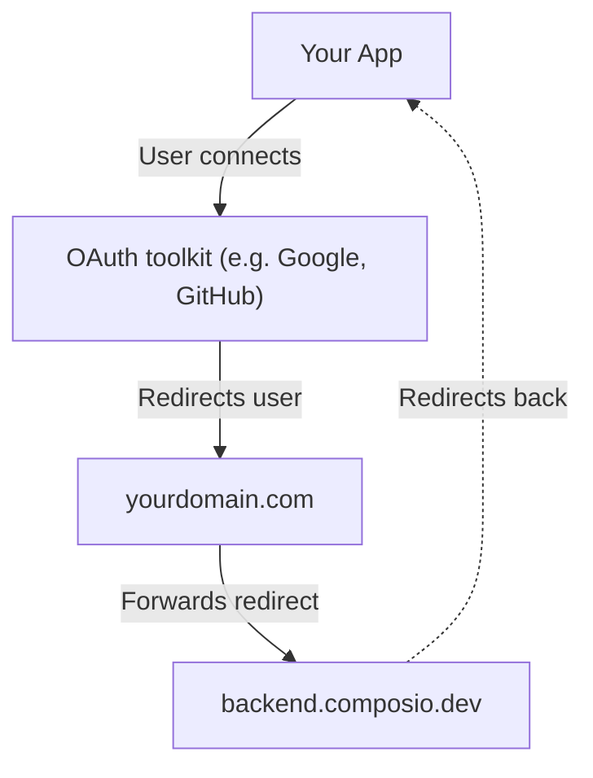

# White-labeling (direct execution) (/docs/auth-configuration/white-labeling)

> If you're building an agent with sessions, see [White-labeling authentication](/docs/white-labeling-authentication) instead.

There are four places where Composio branding shows up during authentication:

| Where                                                                  | What users see                                                    | How to fix                             |
| ---------------------------------------------------------------------- | ----------------------------------------------------------------- | -------------------------------------- |
| [**Connect Link page**](#customizing-the-connect-link)                 | Composio logo and name on the hosted auth page                    | Change logo + app title in dashboard   |
| [**OAuth consent screen**](#using-your-own-oauth-apps)                 | "Composio wants to access your account" on Google, GitHub, etc.   | Use your own OAuth app                 |
| [**Outgoing redirect**](#sending-users-directly-to-the-oauth-provider) | `backend.composio.dev` in browser before reaching OAuth provider  | Use `long_redirect_url` option         |
| [**Return redirect**](#routing-the-callback-through-your-domain)       | `backend.composio.dev` flashes when OAuth provider redirects back | Proxy the redirect through your domain |

# Customizing the Connect Link

The Connect Link is the hosted page your users see when connecting their accounts. By default it shows Composio branding.

To replace it with your own branding:

1. Go to **Project Settings** → [**Auth Screen**](https://platform.composio.dev?next_page=/settings/auth-screen)
2. Upload your **Logo** and set your **App Title**

This applies to all Connect Link flows across all toolkits. Each project has one logo and app title, so if you need different branding per product, use separate projects.

> Customizing the Connect Link only changes the Composio-hosted page. For OAuth toolkits like Gmail, Google Sheets, GitHub, and Slack, users still see a consent screen saying "Composio wants to access your account." To change that, and to remove the "Secured by Composio" badge, set up your own OAuth app as described [below](#using-your-own-oauth-apps).

> **Troubleshooting**: \* **"Secured by Composio" badge won't go away:** This badge is removed when you use your own OAuth app. See [Using your own OAuth apps](#using-your-own-oauth-apps).

- **Logo doesn't appear after uploading:** Clear browser cache or try incognito.
- **Upload fails with "failed to fetch":** Retry or use a smaller image.

# Using your own OAuth apps

OAuth toolkits like Google and GitHub show a consent screen that says which app is requesting access. By default this reads "Composio wants to connect to your account." To show your app name instead, register your own OAuth app and tell Composio to use it. This is done by creating a [custom auth config](/docs/auth-configuration/custom-auth-configs) with your own credentials. See [when to use your own OAuth apps](#when-to-use-your-own-oauth-apps).

> **You don't need this for every toolkit**: Only white-label toolkits where users see a consent screen (Google, GitHub, Slack, etc.). Toolkits that use API keys don't show consent screens, so there's nothing to white-label. You can mix and match freely.

#### Create an OAuth app in the toolkit's developer portal

Register a new OAuth app with the toolkit. Set the callback URL to:

```
https://backend.composio.dev/api/v3/toolkits/auth/callback
```

You'll get a **Client ID** and **Client Secret**.

Step-by-step guides: [Google](https://composio.dev/auth/googleapps) | [Slack](https://composio.dev/auth/slack) | [HubSpot](https://composio.dev/auth/hubspot) | [All toolkits](https://composio.dev/auth)

#### Create an auth config in Composio

In the [Composio dashboard](https://platform.composio.dev):

    1. Go to **Authentication management** → **Create Auth Config**
    2. Select the toolkit (e.g., GitHub)
    3. Choose **OAuth2** scheme
    4. Toggle on **Use your own developer credentials**
    5. Enter your **Client ID** and **Client Secret**
    6. Click **Create**

Copy the auth config ID (e.g., `ac_1234abcd`).

#### Pass the auth config ID when initiating a connection

Pass your custom auth config ID when initiating a connection:

**Python:**

```python
from composio import Composio

composio = Composio(api_key="your_api_key")

# White-labeled: users see your brand on the consent screen
github_conn = composio.connected_accounts.initiate(
    user_id="user_123",
    auth_config_id="ac_your_github_config",
)
print(f"Redirect to: {github_conn.redirect_url}")
```

**TypeScript:**

```typescript
import { Composio } from "@composio/core";
const composio = new Composio({ apiKey: "your_api_key" });
// White-labeled: users see your brand on the consent screen
const githubConn = await composio.connectedAccounts.initiate(
  "user_123",
  "ac_your_github_config"
);
console.log("Redirect to:", githubConn.redirectUrl);
```

For toolkits you haven't white-labeled, use the auth config ID from **Authentication management** in your dashboard.

## When to use your own OAuth apps

- **Production apps** where end users see consent screens. They should see your brand, not Composio's.
- **Enterprise customers** who require your branding end-to-end.
- **Toolkits where you need custom scopes** beyond what Composio's default app provides.

For development and testing, Composio's managed auth works fine. No OAuth app setup required.

## Switching from Composio-managed to your own OAuth app

Existing connected accounts are permanently tied to the auth config they were created with. Switching to a custom auth config does not affect them.

- Existing connections keep working. Tokens continue refreshing using the original auth config's credentials.
- New connections use your custom auth config. Users who connect after the switch will see your app name on the consent screen.
- To fully migrate a user, delete their old connected account and have them re-authenticate through your OAuth app.

# Sending users directly to the OAuth provider

By default, when you initiate a connection, Composio returns a shortened redirect URL (`backend.composio.dev/api/v3/s/...`). The user's browser hits this URL first, then gets redirected to the OAuth provider. This means `backend.composio.dev` briefly appears in the browser.

To skip this and send users directly to the OAuth provider, pass `long_redirect_url: true` when initiating the connection:

**Python:**

```python
from composio import Composio

composio = Composio(api_key="your_api_key")

github_conn = composio.connected_accounts.initiate(
    user_id="user_123",
    auth_config_id="ac_your_github_config",
    config={
        "auth_scheme": "OAUTH2",
        "val": {"status": "INITIALIZING", "long_redirect_url": True},
    },
)
print(f"Redirect to: {github_conn.redirect_url}")
```

**TypeScript:**

```typescript
import { Composio } from "@composio/core";
const composio = new Composio({ apiKey: "your_api_key" });
const githubConn = await composio.connectedAccounts.initiate(
  "user_123",
  "ac_your_github_config",
  {
    config: {
      authScheme: "OAUTH2",
      // val fields use snake_case — they're sent to the API as-is
      val: { status: "INITIALIZING", long_redirect_url: true },
    },
  }
);
console.log("Redirect to:", githubConn.redirectUrl);
```

The redirect URL returned will point directly to the OAuth provider (e.g., `accounts.google.com/o/oauth2/auth?...`) instead of going through Composio first.

# Routing the callback through your domain

After the user authorizes, the OAuth provider redirects back through `backend.composio.dev` so Composio can capture the auth token. Some toolkits also display this URL on the consent screen.

If you need to hide Composio's domain from this return redirect, you can proxy it through your own domain.

#### Set the redirect URI to your domain

In your OAuth app's settings, set the authorized redirect URI to your own endpoint:

```
https://yourdomain.com/api/composio-redirect
```

#### Create a proxy endpoint

This endpoint receives the OAuth callback and immediately 302-redirects it to Composio:

**Python:**

```python
from fastapi import FastAPI, Request
from fastapi.responses import RedirectResponse

app = FastAPI()

@app.get("/api/composio-redirect")
def composio_redirect(request: Request):
    composio_url = "https://backend.composio.dev/api/v3/toolkits/auth/callback"
    return RedirectResponse(url=f"{composio_url}?{request.url.query}")
```

**TypeScript:**

```typescript
// pages/api/composio-redirect.ts (Next.js)
import type { NextApiRequest, NextApiResponse } from "next";

export default function handler(req: NextApiRequest, res: NextApiResponse) {
  const composioUrl =
    "https://backend.composio.dev/api/v3/toolkits/auth/callback";
  const params = new URLSearchParams(req.query as Record<string, string>);
  res.redirect(302, `${composioUrl}?${params.toString()}`);
}
```

> Your endpoint must return a **302 redirect**. Do not follow the redirect server-side or make a fetch call to Composio. The user's browser needs to be redirected so the OAuth flow completes correctly.

#### Update your auth config

In the Composio dashboard, update your auth config to use your custom redirect URI.


_Setting the custom redirect URI in your auth config_

Here's how the redirect flow works. Your proxy just forwards the browser redirect to Composio. It never touches the authorization code or token.



> For FAQs and setup guides for individual toolkits, browse the [toolkits page](/toolkits).

# What to read next

- [Connected accounts](/docs/auth-configuration/connected-accounts): Manage and monitor user connections to toolkits

- [Custom auth configs](/docs/auth-configuration/custom-auth-configs): Customize auth configs with your own OAuth apps

- [Authenticating tools](/docs/tools-direct/authenticating-tools): Create auth configs and connect user accounts

---

📚 **More documentation:** [View all docs](https://docs.composio.dev/llms.txt) | [Glossary](https://docs.composio.dev/llms.mdx/docs/glossary) | [Cookbooks](https://docs.composio.dev/llms.mdx/cookbooks) | [API Reference](https://docs.composio.dev/llms.mdx/reference)

---

# Composio SDK — Instructions for AI Code Generators

**Context:** This page documents the **direct tool execution API**. For most applications, the session-based pattern (`composio.create(user_id)` + `session.tools()`) is simpler — but if the user is here, they likely want direct execution.

---

## Key Patterns

### Authenticating Users

Create an **Auth Config** on [platform.composio.dev](https://platform.composio.dev), then use the auth config ID to generate a hosted auth URL:

```python
from composio import Composio

composio = Composio()
connection = composio.connected_accounts.link(
    user_id="user_123",
    auth_config_id="ac_...",  # from platform dashboard
)
print(connection.redirect_url)  # send user here to authenticate
```

```typescript
import { Composio } from "@composio/core";

const composio = new Composio();
const connection = await composio.connectedAccounts.link("user_123", "ac_...", {
  callbackUrl: "https://your-app.com/callback",
});
console.log(connection.redirectUrl); // send user here to authenticate
```

### Executing Tools

```python
tools = composio.tools.get("user_123", tools=["GITHUB_CREATE_ISSUE"])

result = composio.tools.execute(
    "GITHUB_CREATE_ISSUE",
    {"owner": "org", "repo": "repo", "title": "Bug report"},
    user_id="user_123",
)
```

```typescript
const tools = await composio.tools.get("user_123", {
  tools: ["GITHUB_CREATE_ISSUE"],
});

const result = await composio.tools.execute("GITHUB_CREATE_ISSUE", {
  userId: "user_123",
  arguments: { owner: "org", repo: "repo", title: "Bug report" },
});
```

---

## Rules

1. **`user_id` is required** — pass it to `tools.get()`, `tools.execute()`, and `provider.handle_tool_calls()`.
2. **`tools.execute()` signature** — Python: `execute(slug, arguments_dict, *, user_id=...)` (arguments is the second positional param). TypeScript: `execute(slug, { userId, arguments })`.
3. **Provider at init** — `Composio(provider=OpenAIProvider())` in Python, `new Composio({ provider: new OpenAIProvider() })` in TypeScript. Defaults to OpenAI if omitted.
4. **Correct provider imports** — `composio_<provider>` for Python, `@composio/<provider>` for TypeScript. For OpenAI Agents SDK use `composio_openai_agents` / `@composio/openai-agents`.

---

## Terminology Migration (old → current)

If you encounter these terms in error messages, old documentation, or user prompts, translate them to the current equivalents. **Do not use the old terms in generated code or explanations.**

| Old term (v1/v2)                | Current term (v3)                | In code                                 |
| ------------------------------- | -------------------------------- | --------------------------------------- |
| entity ID                       | user ID                          | `user_id` parameter                     |
| actions                         | tools                            | e.g., `GITHUB_CREATE_ISSUE` is a _tool_ |
| apps / appType                  | toolkits                         | e.g., `github` is a _toolkit_           |
| integration / integration ID    | auth config / auth config ID     | `auth_config_id` parameter              |
| connection                      | connected account                | `connected_accounts` namespace          |
| ComposioToolSet / OpenAIToolSet | `Composio` class with a provider | `Composio(provider=...)`                |
| toolset                         | provider                         | e.g., `OpenAIProvider`                  |

If a user says "entity ID", they mean `user_id`. If they say "integration", they mean "auth config". Always respond using the current terminology.
