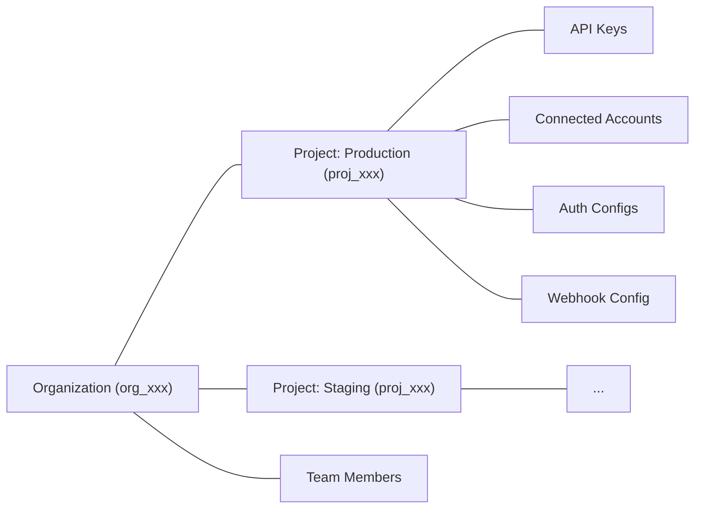

# Projects (/docs/projects)

Projects are Composio's multi-tenancy primitive. Every Composio account belongs to an **organization**. Inside an organization, **projects** are isolated environments that scope your API keys, connected accounts, auth configs, and webhook configurations. Resources in one project are not accessible from another.



Common reasons to use multiple projects:

- **Separate environments**: keep production and staging isolated
- **Separate products**: keep resources for different apps independent
- **Client isolation**: give each client their own project with separate credentials and data

# Managing projects

You can manage projects from the [dashboard](https://platform.composio.dev?next_page=/settings) or via the API using an **organization API key** (`x-org-api-key`).

> Project management endpoints use the `x-org-api-key` header, not the regular `x-api-key`. You can find your org API key in the dashboard under **Settings > Organization**.

## Create a project

```bash
curl -X POST https://backend.composio.dev/api/v3/org/owner/project/new \
  -H "x-org-api-key: YOUR_ORG_API_KEY" \
  -H "Content-Type: application/json" \
  -d '{
    "name": "my-staging-project",
    "should_create_api_key": true
  }'
```

The response includes the project ID and, if requested, an API key:

```json
{
  "id": "proj_abc123xyz456",
  "name": "my-staging-project",
  "api_key": "ak_abc123xyz456"
}
```

## List projects

```bash
curl https://backend.composio.dev/api/v3/org/owner/project/list \
  -H "x-org-api-key: YOUR_ORG_API_KEY"
```

Supports pagination with `limit` and `cursor` query parameters.

## Get project details

```bash
curl https://backend.composio.dev/api/v3/org/owner/project/proj_abc123xyz456 \
  -H "x-org-api-key: YOUR_ORG_API_KEY"
```

Returns the full project object including its API keys.

# Project settings

Each project has settings that control security, logging, and display behavior. These endpoints use your **project API key** (`x-api-key`), not the org key.

```bash
curl -X PATCH https://backend.composio.dev/api/v3/org/project/config \
  -H "x-api-key: YOUR_API_KEY" \
  -H "Content-Type: application/json" \
  -d '{
    "mask_secret_keys_in_connected_account": false,
    "log_visibility_setting": "show_all"
  }'
```

Notable security setting:

- `require_mcp_api_key`: when `true`, MCP server requests must include a valid `x-api-key` header. This defaults to `true` for organizations created on or after March 5, 2026.

You can also view and update these from **Settings > Project Settings** in the [dashboard](https://platform.composio.dev?next_page=/settings). See the [Projects API reference](/reference/api-reference/projects) for all available settings.

# What to read next

- [Authentication](/docs/authentication): Auth configs are scoped to projects — learn how Composio manages auth

- [Users & Sessions](/docs/users-and-sessions): Connected accounts and sessions live within a project

- [Triggers](/docs/triggers): Webhook configurations are project-scoped

---

📚 **More documentation:** [View all docs](https://docs.composio.dev/llms.txt) | [Glossary](https://docs.composio.dev/llms.mdx/docs/glossary) | [Cookbooks](https://docs.composio.dev/llms.mdx/cookbooks) | [API Reference](https://docs.composio.dev/llms.mdx/reference)

---

# Composio SDK — Instructions for AI Code Generators

**Purpose:** Enforce only the **current** and **correct** patterns for integrating [Composio](https://composio.dev/) tools into AI agents.
**Scope:** All AI-generated code using Composio must follow these guardrails.

---

## 1. Correct Composio Integration

Composio supports two integration modes: **Native Tools** (with a provider package) and **MCP** (no provider package needed).

### Native Tools

```python
# ✅ CORRECT — Python (defaults to OpenAI)
from composio import Composio

composio = Composio()
session = composio.create(user_id="user_123")
tools = session.tools()
# Pass tools to your agent/LLM framework
```

```typescript
// ✅ CORRECT — TypeScript (defaults to OpenAI)
import { Composio } from "@composio/core";

const composio = new Composio();
const session = await composio.create("user_123");
const tools = await session.tools();
// Pass tools to your agent/LLM framework
```

For other providers, pass the provider explicitly. Provider packages follow the naming convention: `composio_<provider>` for Python, `@composio/<provider>` for TypeScript.

### MCP

Use `session.mcp.url` and `session.mcp.headers` with any MCP-compatible client (Claude Desktop, Cursor, OpenAI Agents, etc.). No provider package needed.

---

## 2. CRITICAL INSTRUCTIONS FOR AI MODELS

### 2.1 — ALWAYS DO THE FOLLOWING

1. **Use `composio.create(user_id)`** to create a session — this is the entry point for all Composio integrations.
2. **Use `session.tools()`** for native tool integration or **`session.mcp.url`** for MCP integration.
3. **Import** from the correct provider package (`composio_<provider>` for Python, `@composio/<provider>` for TypeScript).
4. **Pass `user_id` to `composio.create()`**, not to individual tool calls.

### 2.2 — NEVER DO THE FOLLOWING

1. **Do not** instruct users to manually create auth configs or connected accounts before running.
2. **Do not** import from `composio_openai` / `@composio/openai` when using OpenAI Agents SDK — use `composio_openai_agents` / `@composio/openai-agents` instead.

### 2.3 — DISCOURAGED (do not use unless user explicitly asks)

Do **not** generate `composio.tools.get()`, `composio.tools.execute()`, or `composio.provider.handle_tool_calls()` unless the user explicitly requests direct tool execution. These are a supported but **not recommended** low-level interface.

---

## Terminology Migration (old → current)

If you encounter these terms in error messages, old documentation, or user prompts, translate them to the current equivalents. **Do not use the old terms in generated code or explanations.**

| Old term (v1/v2)                | Current term (v3)                | In code                                 |
| ------------------------------- | -------------------------------- | --------------------------------------- |
| entity ID                       | user ID                          | `user_id` parameter                     |
| actions                         | tools                            | e.g., `GITHUB_CREATE_ISSUE` is a _tool_ |
| apps / appType                  | toolkits                         | e.g., `github` is a _toolkit_           |
| integration / integration ID    | auth config / auth config ID     | `auth_config_id` parameter              |
| connection                      | connected account                | `connected_accounts` namespace          |
| ComposioToolSet / OpenAIToolSet | `Composio` class with a provider | `Composio(provider=...)`                |
| toolset                         | provider                         | e.g., `OpenAIProvider`                  |

If a user says "entity ID", they mean `user_id`. If they say "integration", they mean "auth config". Always respond using the current terminology.
