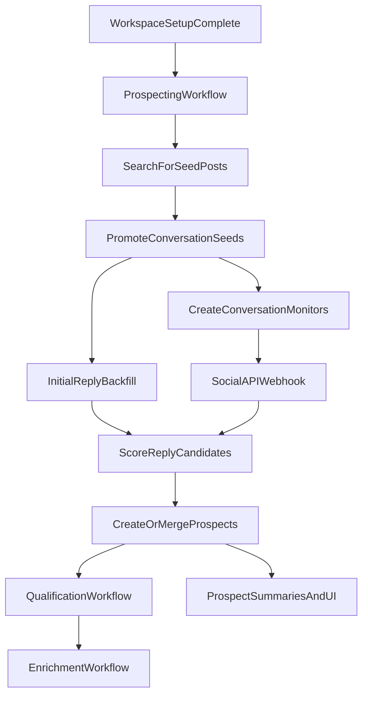

# X Reply-Driven Prospecting Plan

## Goal

- Extend the existing background prospecting flow so it can discover prospects from X/Twitter reply threads under strong seed posts.
- Keep the product UX simple: setup still kicks off prospecting automatically, prospects still appear in the same feed, and reply-derived prospects still go through the same qualification, enrichment, and outreach planning pipeline.
- Keep this phase intentionally narrow: X only, no follower/following discovery, no LinkedIn, no generic social graph yet.

## Ground Truth And Constraints

- The current prospecting entrypoint is already workflow-based and starts in the background after setup: [convex/agents/tools/searchProspects.ts](convex/agents/tools/searchProspects.ts), [convex/workflows/prospecting.ts](convex/workflows/prospecting.ts), [convex/workspaces.ts](convex/workspaces.ts).
- Search-query monitors already exist and already post into `/socialapi-webhook`: [convex/socialapiMonitors.ts](convex/socialapiMonitors.ts), [convex/http.ts](convex/http.ts), [convex/schema.ts](convex/schema.ts).
- SocialAPI supports `conversation_id:TWEET_ID`, cursor pagination for search, thread fetch with cursor, and search-query monitors with webhooks: [docs/socialapi/search.md](docs/socialapi/search.md), [docs/socialapi/thread.md](docs/socialapi/thread.md), [docs/socialapi/monitor-and-operators.md](docs/socialapi/monitor-and-operators.md).
- SocialAPI monitor webhooks do not retry failed deliveries, so webhook handling must be idempotent and durable: [docs/socialapi/monitor-and-operators.md](docs/socialapi/monitor-and-operators.md).
- The current X search helper auto-wraps queries as exact phrases, so it cannot safely execute raw `conversation_id:` operator searches for reply discovery: [convex/integrations/twitter/searchPosts.ts](convex/integrations/twitter/searchPosts.ts).
- The current `ConversationPanel` uses `api.socialapi.getDynamicThreadData`, which only calls `/twitter/thread/{threadId}` and does not provide full cross-user conversation context or cursor-driven load more. There is also a separate, stronger but unused conversation helper in `outreachActions`, so the codebase already has duplicate conversation-fetch paths that should be unified: [features/prospects/ui/components/ConversationPanel.tsx](features/prospects/ui/components/ConversationPanel.tsx), [convex/socialapi.ts](convex/socialapi.ts), [convex/outreachActions.ts](convex/outreachActions.ts).
- Official X webhook docs are useful for webhook expectations, but local X Activity docs explicitly state XAA does not deliver posts, so this feature should remain SocialAPI-led rather than switching to X Activity: [docs/x/x-api/webhooks/introduction.md](docs/x/x-api/webhooks/introduction.md), [docs/x/x-api/webhooks/create-replay-job-for-webhook.md](docs/x/x-api/webhooks/create-replay-job-for-webhook.md), [docs/x/x-api/x-activity/introduction.md](docs/x/x-api/x-activity/introduction.md).

## Product Outcome

### Setup And Background Discovery

- The user still completes setup exactly the same way.
- The existing background prospecting workflow still starts automatically.
- Prospecting now has two internal X discovery layers:
  - direct search-based prospect discovery (current behavior)
  - reply-thread prospect discovery from promoted seed posts (new behavior)
- There is no new top-level button, page, or manual trigger.

### Prospect Feed UX

- The existing feed remains the main surface: [app/(webapp)/page.tsx](<app/(webapp)/page.tsx>).
- Reply-derived prospects appear in the same list as other prospects.
- Each reply-derived prospect gets a compact provenance signal in the existing card UI, such as `Found in X reply`, plus a short discovery snippet if it can be shown without clutter.
- The list still behaves the same from the user’s perspective: browse, search, click, inspect.

### Prospect Detail UX

- The existing profile shell remains the main detail surface: [features/prospects/ui/components/ProspectProfilePanel.tsx](features/prospects/ui/components/ProspectProfilePanel.tsx).
- Add a `Discovery Context` section to the existing overview/details surface rather than creating a new page or top-level tab.
- That section should show:
  - the root seed post
  - the matched reply
  - why it matched
  - a CTA to open the conversation context

### Conversation UX

- Reuse the existing `ConversationPanel`, but replace its backend source with one canonical X conversation-context API.
- The panel should show:
  - the root post
  - any same-author self-thread context
  - cross-user replies in that conversation
  - the matched reply preserved and highlighted
  - cursor-based `Load more replies` behavior
- Keep `YourInteractionsTab` focused on real user/prospect interactions only; do not overload it with discovery provenance: [features/prospects/ui/components/tabs/YourInteractionsTab.tsx](features/prospects/ui/components/tabs/YourInteractionsTab.tsx), [features/prospects/types.ts](features/prospects/types.ts).

## Final Backend Flow

## Implementation Surface

- [convex/workflows/prospecting.ts](convex/workflows/prospecting.ts): keep the main orchestration entrypoint; add seed promotion, initial reply backfill, and conversation-monitor creation stages.
- [convex/integrations/twitter/searchPosts.ts](convex/integrations/twitter/searchPosts.ts): keep the current exact-phrase search path for existing prospecting, and add a new raw-operator search path for `conversation_id:` queries and parallel reply-search variants.
- [convex/socialapiMonitors.ts](convex/socialapiMonitors.ts): reuse the existing search-query monitor lifecycle for ongoing reply monitoring; extend it with monitor purpose and seed linkage.
- [convex/http.ts](convex/http.ts): keep `/socialapi-webhook` as the single ingestion point; branch `search_keyword` monitor handling by local monitor purpose.
- [convex/prospects.ts](convex/prospects.ts): add a dedicated reply-derived prospect save/merge path instead of reusing today’s generic webhook save logic unchanged.
- [convex/socialapi.ts](convex/socialapi.ts) and [convex/integrations/twitter/getThread.ts](convex/integrations/twitter/getThread.ts): implement the canonical conversation-context fetcher with cursor support.
- [convex/prospectSummaries.ts](convex/prospectSummaries.ts) and [convex/lib/readModelHelpers.ts](convex/lib/readModelHelpers.ts): surface discovery provenance into read models so the feed can show a badge/snippet cheaply.
- [features/prospects/ui/components/prospect-card/ProspectCard.tsx](features/prospects/ui/components/prospect-card/ProspectCard.tsx) and nearby card components: add lightweight provenance UI.
- [features/prospects/ui/components/ConversationPanel.tsx](features/prospects/ui/components/ConversationPanel.tsx): switch to the new canonical conversation-context API and add load-more cursor UX.
- [app/(webapp)/page.tsx](<app/(webapp)/page.tsx>): keep the same list behavior, only wire in any read-model changes needed for provenance display.

## Data Model Changes

### New Tables

- Add `twitterConversationSeeds` in [convex/schema.ts](convex/schema.ts).
- Each row represents one promoted root post whose reply thread is worth mining and monitoring.
- Store:
  - `workspaceId`, `userId`
  - `rootTweetId`, `conversationId`, `rootAuthorId`, `rootAuthorUsername`
  - `rootTweetData` or a normalized summary snapshot
  - `sourceSearchQuery`, `sourceKeyword`, and seed-score metadata
  - `status` such as `pending_backfill`, `active`, `paused`, `archived`, `failed`
  - `initialBackfillCompletedAt`, `lastBackfillCursor`, `lastReplySeenAt`, `monitorId`, `lastWebhookAt`
  - stats such as `totalRepliesSeen`, `totalCandidatesAccepted`, `totalProspectsCreated`
- Add indexes for `by_workspace_status`, `by_root_tweet_id`, and `by_monitor_id`.

- Add `twitterReplyDiscoveryCandidates` in [convex/schema.ts](convex/schema.ts).
- Each row represents one reply discovered under one tracked seed.
- Store:
  - `seedId`, `workspaceId`, `userId`
  - `replyTweetId`, `replyAuthorId`, `replyAuthorUsername`
  - raw or normalized reply data
  - `matchedQueries`, score breakdown, discard reason or acceptance reason
  - `status` such as `pending`, `discarded`, `prospect_created`, `merged_into_existing`
  - optional `prospectId`
  - timestamps for `discoveredAt`, `processedAt`
- Add indexes for `by_seed_reply_tweet`, `by_workspace_status`, and `by_reply_author`.

### Extend Existing Tables

- Extend `socialQueryMonitors` in [convex/schema.ts](convex/schema.ts) with a local purpose enum and optional seed linkage instead of creating a second monitor table.
- Add fields such as `purpose: workspace_query | conversation_seed` and `conversationSeedId`.
- Extend `prospects` in [convex/schema.ts](convex/schema.ts) with explicit reply-discovery provenance.
- Add:
  - a stable actor-level X identifier such as `twitterUserId`
  - `discoverySource: search_post | conversation_reply`
  - `discoveryContext` containing seed post ref, reply ref, matched queries, and candidate or monitor linkage
- This is required because today’s Twitter prospect identity is inconsistent across code paths: `searchTwitterInternal` saves using tweet ID, while `saveProspectFromWebhook` dedupes on user ID. Reply discovery must not inherit that inconsistency silently: [convex/workflows/prospecting.ts](convex/workflows/prospecting.ts), [convex/prospects.ts](convex/prospects.ts).

### Validators And Helper Organization

- Add all new enums and object validators in [convex/validators.ts](convex/validators.ts).
- Keep Convex wrappers thin and move scoring/query-building logic into a focused helper module such as [convex/lib/xConversationDiscoveryCore.ts](convex/lib/xConversationDiscoveryCore.ts), aligned with the repo’s Convex rule to keep business logic in plain TypeScript helpers.
- All public functions should continue to use explicit `args` and `returns` validators.

## Search And Seed Selection

- Preserve the current exact-phrase prospect search path in [convex/integrations/twitter/searchPosts.ts](convex/integrations/twitter/searchPosts.ts) so existing keyword-driven discovery does not regress.
- Add a new raw-operator path such as `searchRaw` and `searchRawBatch` that:
  - accepts raw query strings without wrapping the full query in quotes
  - supports cursor pagination
  - reuses the current retrier and bounded-parallel pattern
- Add a query-builder helper in a focused core module that generates the reply-discovery queries for one seed post.
- The initial backfill strategy for each promoted seed should be:
  - 1 broad query: `conversation_id:SEED_POST_ID`
  - 3-5 targeted raw queries in parallel for the same seed post, grouped by expected reply intent rather than arbitrary keyword explosion
  - examples: pain/struggle wording, looking-for/help wording, role/title wording, use-case-specific phrases
- Deduplicate replies by tweet ID first, then deduplicate resulting prospect creation by `twitterUserId`.
- Promote only a bounded number of seed posts per cycle to control cost and noise.

## Prospecting Workflow Changes

- Refactor the current Twitter search step so the workflow can both:
  - save direct search-derived prospects
  - evaluate returned posts as candidate conversation seeds
- The cleanest path is to split raw tweet retrieval from final prospect save inside [convex/workflows/prospecting.ts](convex/workflows/prospecting.ts), keeping the existing behavior but exposing the intermediate posts for seed selection.
- Add new workflow stages in the same prospecting workflow:
  - `promoteConversationSeeds`
  - `initialBackfillConversationSeeds`
  - `createConversationSeedMonitors`
- Seed scoring should be explicit and stored on the seed row.
- Score on:
  - topical fit
  - freshness
  - engagement floor
  - author quality
  - likelihood that the thread contains buyer/prospect replies
- Keep the current downstream workflow chain unchanged once a reply-derived prospect is saved.

## Ongoing Reply Monitoring Without App-Side Cron

- For every promoted seed that passes backfill and is worth tracking, create one broad SocialAPI search-query monitor using the existing monitor system in [convex/socialapiMonitors.ts](convex/socialapiMonitors.ts).
- The monitor query should be broad enough not to miss valuable replies, for example:
  - `conversation_id:SEED_POST_ID`
  - optional `lang:en`
  - optional `-from:SEED_AUTHOR`
- Do not create multiple long-lived monitors per seed in this phase. Use one broad monitor per seed and score/filter the replies in Convex after webhook delivery.
- This satisfies the no-cron requirement because SocialAPI performs the polling and emits webhooks back to `/socialapi-webhook`.
- Because SocialAPI only inspects up to about 5 pages per execution and does not retry failed webhooks, the ingestion flow must be:
  - idempotent by `seedId + replyTweetId`
  - resilient to duplicate deliveries
  - safe to reprocess without creating duplicate prospects

## Webhook Ingestion

- Keep [convex/http.ts](convex/http.ts) as the single SocialAPI webhook entrypoint.
- Continue routing on `payload.event === new_tweet` and `meta.monitor_id`.
- Change the `search_keyword` branch so it looks up the local monitor record and then branches by local `purpose`.
- For `purpose = workspace_query`, preserve current behavior.
- For `purpose = conversation_seed`, route into a new reply-candidate pipeline that:
  - validates the webhook payload
  - resolves the linked seed row
  - inserts or updates a `twitterReplyDiscoveryCandidates` row idempotently
  - runs reply scoring
  - either discards or promotes the reply into a prospect
  - records seed and monitor stats
- Do not reuse `saveProspectFromWebhookWithRetry` unchanged for reply-thread discovery because it currently lacks seed/reply provenance and assumes the old generic monitor semantics: [convex/prospects.ts](convex/prospects.ts), [convex/http.ts](convex/http.ts).

## Prospect Save, Qualification, And Enrichment

- Add a dedicated reply-derived save path in [convex/prospects.ts](convex/prospects.ts) or a closely related helper file.
- This path should:
  - merge by `workspaceId + twitterUserId` when possible
  - otherwise create a new prospect row
  - store `discoverySource = conversation_reply`
  - store `discoveryContext` with seed post ref, reply ref, matched queries, and acceptance reason
  - continue to populate the existing fields needed by qualification and enrichment
- Keep immediate qualification scheduling unchanged for all accepted prospects.
- Ensure enrichment populates `socialProfiles.twitter.profileId` and `twitterUserId` consistently for all new Twitter prospects so future dedupe stays stable.
- Update read-model builders so list/detail UIs can render provenance without expensive joins.

## Conversation Context API And UI

- Introduce one canonical backend action such as `getConversationContext` in [convex/socialapi.ts](convex/socialapi.ts).
- That action should:
  - fetch the root/self-thread via `/twitter/thread/{rootId}` using the existing thread fetcher in [convex/integrations/twitter/getThread.ts](convex/integrations/twitter/getThread.ts)
  - fetch cross-user replies via SocialAPI search using `conversation_id:rootId`
  - support cursor pagination for replies
  - merge, dedupe, and sort root tweet, self-thread tweets, and cross-user replies into one ordered context payload
  - preserve the matched reply ID so the UI can scroll or highlight it
- Replace `api.socialapi.getDynamicThreadData` usage in [features/prospects/ui/components/ConversationPanel.tsx](features/prospects/ui/components/ConversationPanel.tsx) with this canonical action.
- Add load-more behavior based on cursor instead of loading a fixed one-shot payload.
- Keep the existing panel stack and route structure intact.
- Do not overload `YourInteractionsTab` with discovery context because it is semantically for real user/prospect interactions; show discovery context in the overview/details area and reuse the conversation panel only when the user asks for thread context.

## Cleanup And De-Bloat

- Remove or deprecate duplicate conversation-fetch paths after the new canonical context action is wired everywhere.
- Specifically, unify today’s split between [convex/socialapi.ts](convex/socialapi.ts) and [convex/outreachActions.ts](convex/outreachActions.ts).
- Remove misleading comments that claim `ConversationPanel` already fetches the full conversation via `conversation_id` when it currently does not.
- Delete unused helpers, dead imports, and obsolete props after the refactor.
- Do not add a generic social-graph subsystem yet. This phase should stay narrowly focused on X reply-thread discovery so the codebase remains minimal and clear.

## Skills And Implementation Standards

- Follow [/.cursor/skills/vercel-react-best-practices/SKILL.md](.cursor/skills/vercel-react-best-practices/SKILL.md) for the panel and prospect-list UI updates.
- Follow [/.cursor/skills/frontend-design/SKILL.md](.cursor/skills/frontend-design/SKILL.md) for polished but restrained provenance/context UI without inventing a new product surface.
- Keep Convex wrappers thin and move business logic into shared TypeScript helpers, per the repo’s Convex conventions.
- Use indexed queries instead of `.filter()` for any new lookups on seeds, reply candidates, monitor purpose, or actor-level dedupe fields.

## Validation And Verification

- Run `pnpm exec tsc --noEmit -p tsconfig.json`.
- Run `pnpm exec tsc --noEmit -p convex/tsconfig.json`.
- Run `pnpm lint:strict`.
- Run LSP diagnostics via `ReadLints` on all changed paths, especially `convex`, `features/prospects`, and `app/(webapp)`.
- Manually verify these end-to-end flows:
  - setup still starts background prospecting automatically
  - direct search-derived prospects still appear
  - strong search hits are promoted into tracked conversation seeds
  - initial reply backfill creates reply-derived prospects
  - later replies arrive via SocialAPI webhook without app-side scheduling
  - accepted reply-derived prospects enter the normal qualification and enrichment pipeline
  - the prospects feed shows provenance chips without layout regressions
  - the detail page shows discovery context
  - the conversation panel loads root context and paginates replies correctly
- Do not introduce a new test framework in this phase because the repo currently does not have an established test runner. Keep this implementation lean and validate with the existing static checks plus focused manual verification.

## Documentation And Proof References Used

- SocialAPI search, cursor pagination, and search operators: [docs/socialapi/search.md](docs/socialapi/search.md), [docs/socialapi/monitor-and-operators.md](docs/socialapi/monitor-and-operators.md)
- SocialAPI thread endpoint and cursor pagination: [docs/socialapi/thread.md](docs/socialapi/thread.md)
- SocialAPI direct-reply verification limitations: [docs/socialapi/verify-user-commented.md](docs/socialapi/verify-user-commented.md)
- SocialAPI rate limits: [docs/socialapi/rate-limits.md](docs/socialapi/rate-limits.md)
- Official X webhook expectations and replay support: [docs/x/x-api/webhooks/introduction.md](docs/x/x-api/webhooks/introduction.md), [docs/x/x-api/webhooks/create-replay-job-for-webhook.md](docs/x/x-api/webhooks/create-replay-job-for-webhook.md)
- Official X Activity limitation for posts: [docs/x/x-api/x-activity/introduction.md](docs/x/x-api/x-activity/introduction.md)
- Current code paths used to ground the plan: [convex/workflows/prospecting.ts](convex/workflows/prospecting.ts), [convex/socialapiMonitors.ts](convex/socialapiMonitors.ts), [convex/http.ts](convex/http.ts), [convex/integrations/twitter/searchPosts.ts](convex/integrations/twitter/searchPosts.ts), [convex/integrations/twitter/getThread.ts](convex/integrations/twitter/getThread.ts), [convex/prospects.ts](convex/prospects.ts), [convex/prospectSummaries.ts](convex/prospectSummaries.ts), [convex/socialapi.ts](convex/socialapi.ts), [convex/outreachActions.ts](convex/outreachActions.ts), [features/prospects/ui/components/ConversationPanel.tsx](features/prospects/ui/components/ConversationPanel.tsx), [features/prospects/ui/components/tabs/YourInteractionsTab.tsx](features/prospects/ui/components/tabs/YourInteractionsTab.tsx), [app/(webapp)/page.tsx](<app/(webapp)/page.tsx>).
